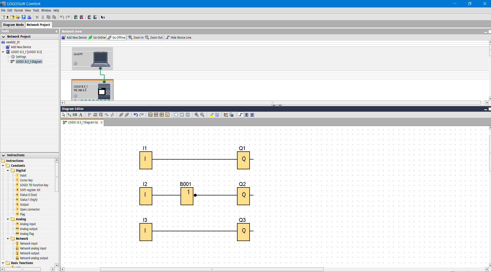
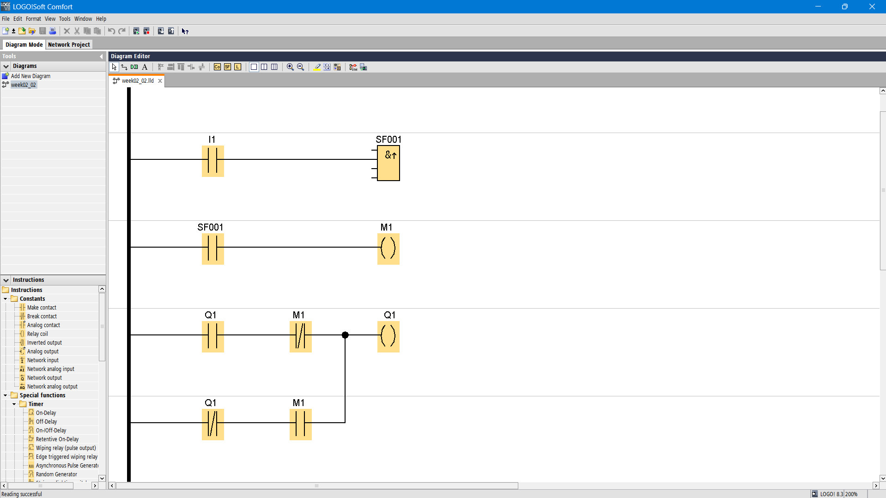
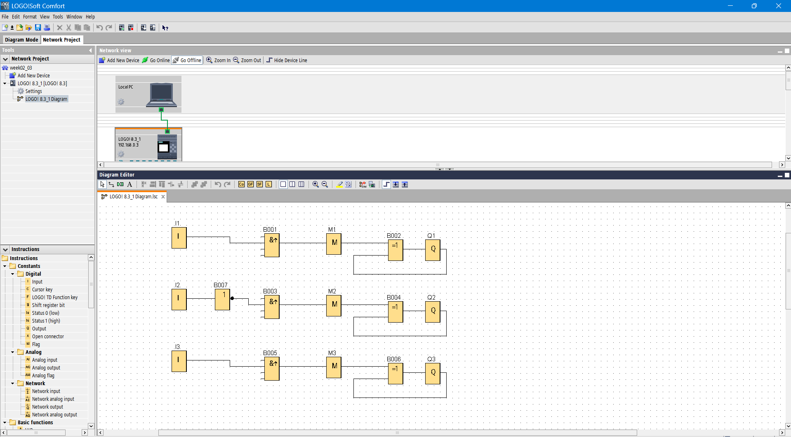
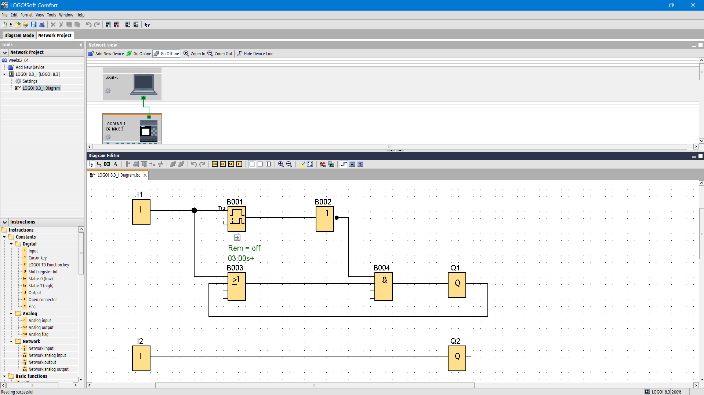
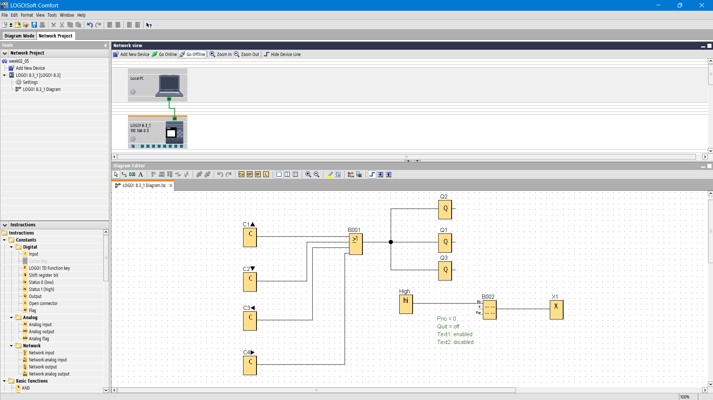
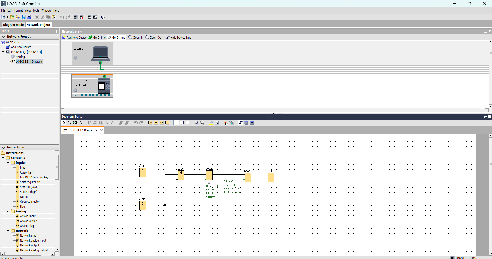
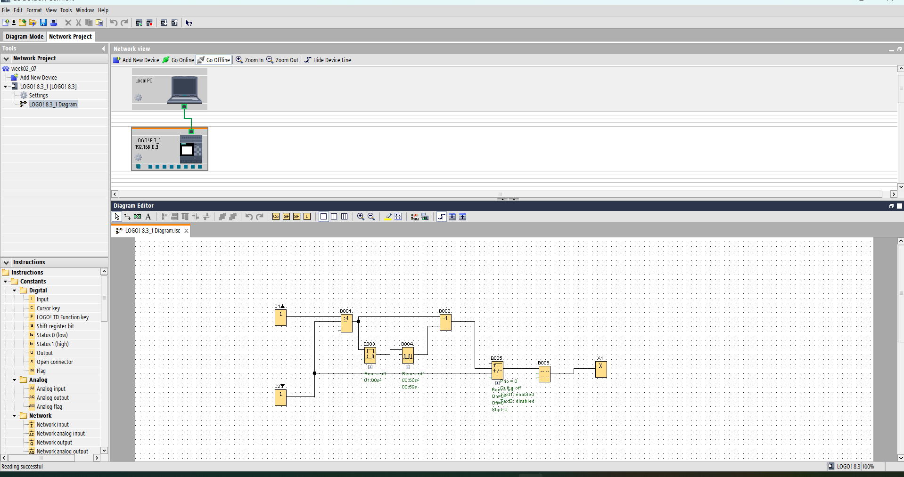
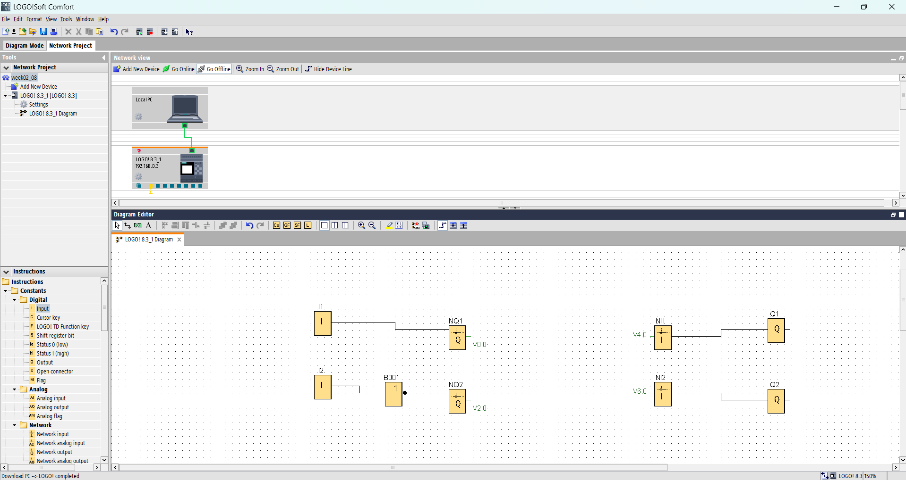
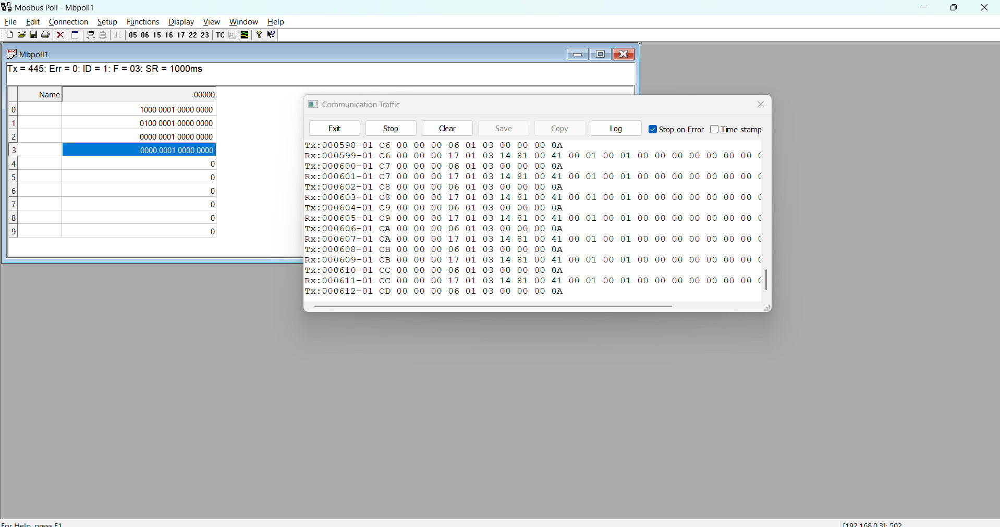
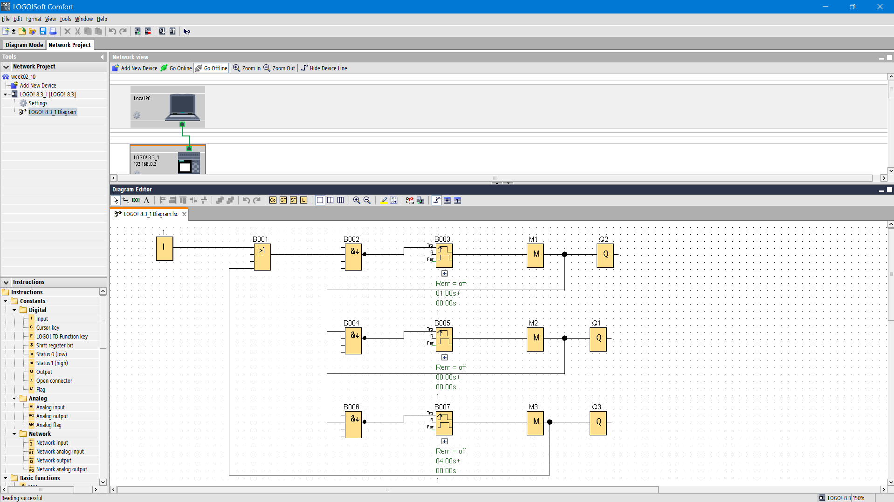

# Week02 Siemens LOGO!8

---

## 📸 รูปภาพประกอบการเรียน (Images)

<b>1. LOGO8_t01_InputOutput</b>

 

เดี๋ยวมาเล่าให้ฟัง

<b>2. LOGO8_t02a_pressOnpressOff_Ladder = Toggle with Ladder</b>

 

เดี๋ยวมาเล่าให้ฟัง

<b>3. LOGO8_t02b_pressOnpressOff = Toggle with FBD</b>

 

เดี๋ยวมาเล่าให้ฟัง

<b>4. LOGO8_t03_pressOn_HoldOff</b>

 

เดี๋ยวมาเล่าให้ฟัง

<b>5. LOGO8_t04_Using_Cursor</b>

 

เดี๋ยวมาเล่าให้ฟัง

<b>6. LOGO8_t05a_Count_Show</b>

 

  
เดี๋ยวมาเล่าให้ฟัง

<b>7. LOGO8_t05b_Count_SpeedUp</b>

 

เดี๋ยวมาเล่าให้ฟัง

<b>8. LOGO8_t10_Modbus_TCP</b>

 

เดี๋ยวมาเล่าให้ฟัง

<b>9. LOGO8_t90_Traffic_Light</b>

 

เดี๋ยวมาเล่าให้ฟัง

  

  <a href="../README.md">
    กลับสู่หน้าหลัก (Main Menu)
  </a>

